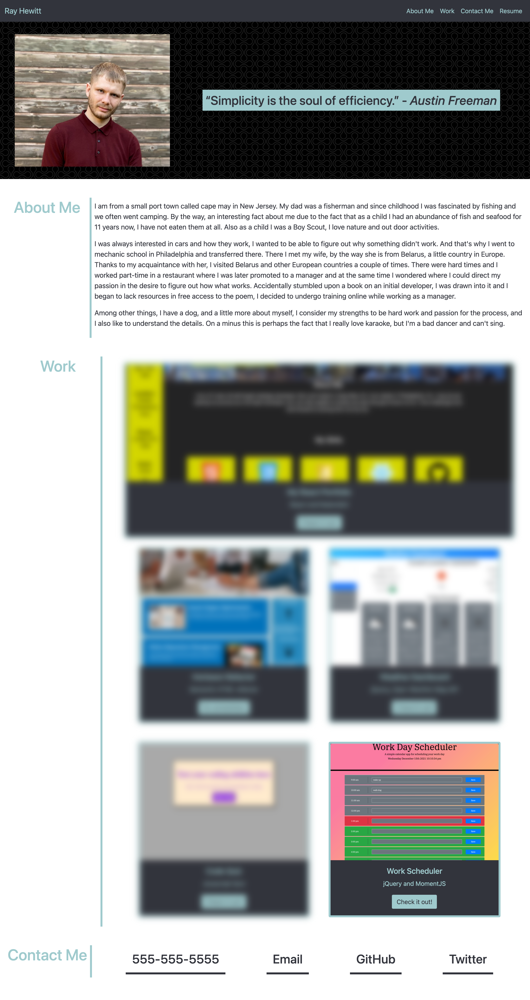
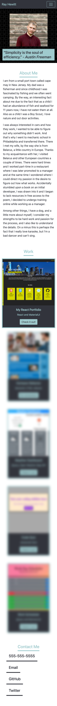

# Portfolio-v1
 

## Description

This is a portfolio I have built in order to try to get a job. I have built this to leverage the flex and flexbox properties in combination with media queries to make my portfolio dynamic. So it will be great to see on any device!

## Installation
 No Installation nessasary go to https://rayman244.github.io/Portfolio-v1/

## Usage

## Credits

Photo by Anastasia Taioglou on 
  https://unsplash.com/@thenata?utm_source=unsplash&utm_medium=referral&utm_content=creditCopyText
  https://unsplash.com/wallpapers/nature/ocean?utm_source=unsplash&utm_medium=referral&utm_content=creditCopyText

  Background photo created by kbza - www.freepik.com</a>
  https://www.freepik.com/photos/background

  Background vector created by freepik - www.freepik.com
  https://www.freepik.com/vectors/background

## License
MIT License

Copyright (c) 2021 MyMain

Permission is hereby granted, free of charge, to any person obtaining a copy
of this software and associated documentation files (the "Software"), to deal
in the Software without restriction, including without limitation the rights
to use, copy, modify, merge, publish, distribute, sublicense, and/or sell
copies of the Software, and to permit persons to whom the Software is
furnished to do so, subject to the following conditions:

The above copyright notice and this permission notice shall be included in all
copies or substantial portions of the Software.

THE SOFTWARE IS PROVIDED "AS IS", WITHOUT WARRANTY OF ANY KIND, EXPRESS OR
IMPLIED, INCLUDING BUT NOT LIMITED TO THE WARRANTIES OF MERCHANTABILITY,
FITNESS FOR A PARTICULAR PURPOSE AND NONINFRINGEMENT. IN NO EVENT SHALL THE
AUTHORS OR COPYRIGHT HOLDERS BE LIABLE FOR ANY CLAIM, DAMAGES OR OTHER
LIABILITY, WHETHER IN AN ACTION OF CONTRACT, TORT OR OTHERWISE, ARISING FROM,
OUT OF OR IN CONNECTION WITH THE SOFTWARE OR THE USE OR OTHER DEALINGS IN THE
SOFTWARE.
---

## Badges

## Features
Links to my projects as well as ways to contact

## How to Contribute
Leave a comment in my github or report an issue on the repository

## Tests
No errors found